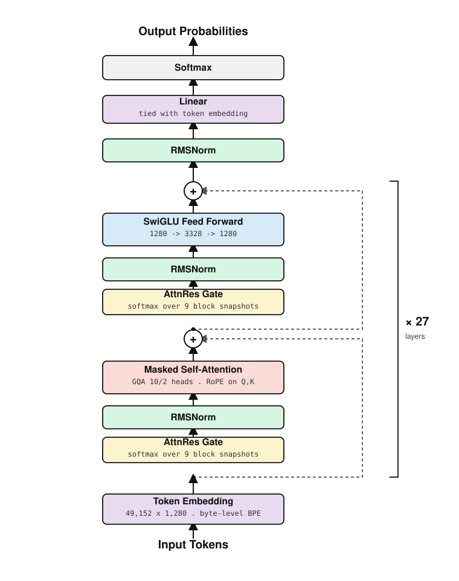

# Mimans M1

A 514,345,526-parameter code language model, built from scratch — tokenizer,
architecture, training loop, and GPU kernels — sized to pretrain on a single
RTX 5090.

<p align="center"></p>

## What this is

Not a fine-tune. Every layer of the stack is original:

- **Tokenizer** — byte-level BPE, 49,152 vocab, trained on a code/text/math
  mixture, 21 acceptance tests including FIM round-trips, 3.79 bytes/token.
- **Architecture** — 27-layer decoder, GQA attention with RoPE, SwiGLU FFN,
  tied embedding/head, and AttnRes: a learned softmax gate over residual-stream
  snapshots in place of a fixed skip connection.
- **Kernels** — hand-written TileLang kernels for flash attention, SwiGLU, and
  a fused cross-entropy head, each checked against reference math.
- **Training system** — a single-GPU pretraining pipeline: staged 40B-token
  curriculum, Muon + AdamW, kernel autotuning cache, and session-based
  checkpoint/resume, built for one card with no cluster to fall back on.

## Architecture

| | |
|---|---|
| parameters | 514,345,526 |
| layers | 27 (9 blocks × 3) |
| d_model | 1,280 |
| attention | GQA — 10 query heads / 2 kv heads, head_dim 128, RoPE |
| FFN | SwiGLU, hidden 3,328 |
| vocab | 49,152, tied embedding / head |
| context | 2,048 → 8,192 (staged) |

Full recipe, optimizer, and schedule: [CODE/RECIPE.md](CODE/RECIPE.md)

## Five bugs that would have cost the run

Caught before step 1. None of them crash — they silently corrupt the run or
burn GPU time instead:

1. **Kernel correctness** — warp specialisation sank a pre-loop init into the
   vocabulary loop, so the fused cross-entropy kernel silently kept only the
   last vocab tile. Error ~5.0 → 2e-6 after the fix, found by reading the
   generated CUDA.
2. **Resume** — `torch.load`'s `map_location` moved the saved RNG state onto
   the GPU; `set_rng_state` only accepts a CPU tensor. Every restart failed.
3. **Batch/context coupling** — the context-length stage change updated
   `seq_len` but not `micro_batch`, which would have silently cut gradient
   accumulation from 32 to 8 at the 36B-token mark.
4. **Initialization** — a tied LM head over a zero-init identity stack starts
   certain the answer is the token it was just given. Step 0 cost 25.3 nats
   instead of the expected log(vocab) = 10.80.
5. **Checkpoint pruning** — the retention rule kept only steps divisible by
   `save_every × 10`, which wall-clock saves never land on, silently deleting
   every milestone it was meant to protect.

## Status

**Verified** — architecture, kernels, and tokenizer; every module ships a
`check()` that runs on execution. Checkpoint save/resume, verified across
separate processes.

**Not yet** — pretraining hasn't started; raw text isn't converted to shards
yet. Throughput/MFU at full scale is unmeasured, and eval isn't wired into the
training loop.

## Running it

```bash
cd CODE
python -m mimans.model.model                    # architecture self-check
python -m mimans.model.attention_tilelang --gpu  # kernel vs. reference
python -m mimans.training.preflight --quick      # end-to-end, seconds
python -m mimans.tokenizer.train_tokenizer --check
```

Full layout and module list: [CODE/README.md](CODE/README.md)

## License

Apache 2.0 — see [LICENSE](LICENSE).
